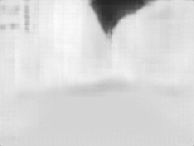
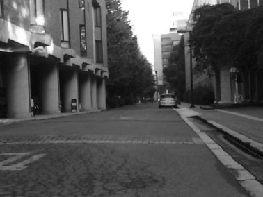

# RTFGAN_t
RTFGAN

RTFGAN is a robotics class project to inspired by [RTFNet](https://github.com/yuxiangsun/RTFNet/). Some of the code are borrowed from classmates. 

The current version supports Python>=3.6, CUDA>=11.1 and PyTorch>=1.7.1, but it should work fine with lower versions of CUDA and PyTorch. The training runs on [HIPERGATOR 3.0](https://www.rc.ufl.edu/services/hipergator/).

## Introduction 

The goal is to build a GAN model that can recover thermal image from RGB image. 

Used VGG perceptual loss to train generator as the starts, then implement GAN. 

Use Adam as optimization solver.

Wasserstein GAN with gradient penalty is implemented .
(https://machinelearningmastery.com/how-to-implement-wasserstein-loss-for-generative-adversarial-networks/)

Implement CLASS with pytorch module.

Alternative training: Discriminator trained for X iterations then train generator. 

## Dataset
 
The original dataset can be downloaded from the MFNet project [page](https://www.mi.t.u-tokyo.ac.jp/static/projects/mil_multispectral/), but you are encouraged to download our preprocessed dataset from [here](http://gofile.me/4jm56/CfukComo1).

